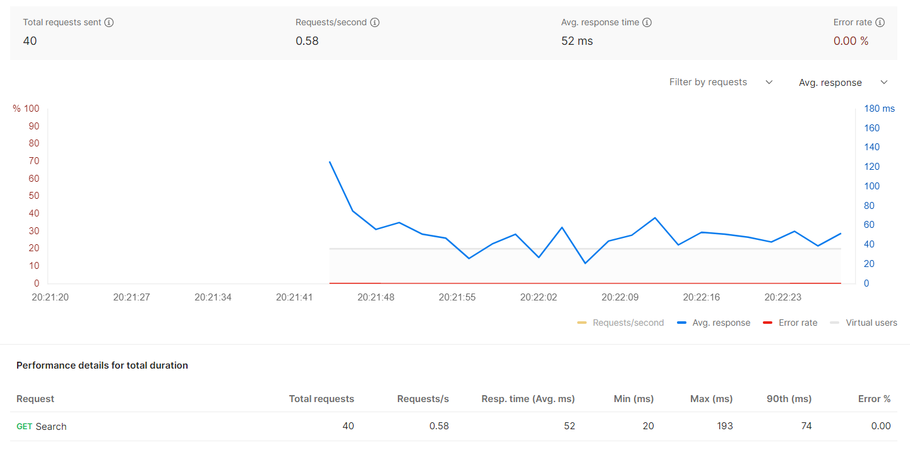
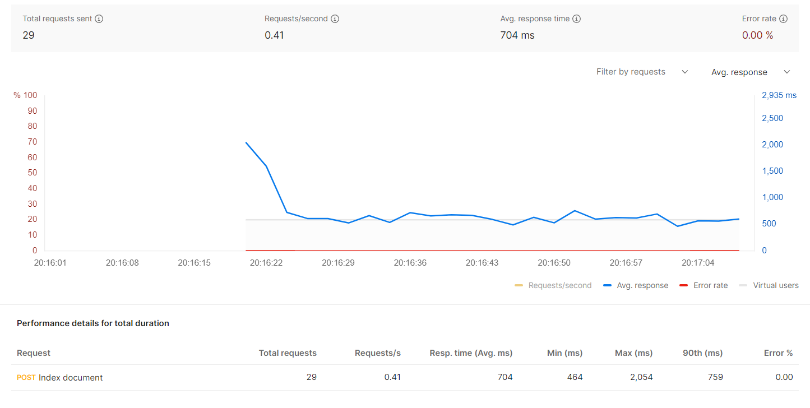

# TF-IDF Search Engine

This project is a FastAPI-based search application designed to query the 20 Newsgroups dataset using a custom search engine. The application leverages TF-IDF (Term Frequency-Inverse Document Frequency) scoring to rank documents by relevance in response to user queries. It includes a dataset module that wraps the 20 Newsgroups data, providing efficient access and management. The search engine module utilizes a vectorizer to convert text into a TF-IDF document-term matrix, enabling accurate and performant search capabilities. The project is structured to be easily deployable using Docker and configurable through environment variables.

## Project Directory Structure

### Root Directory

- **.env**: This file contains environment variables used to configure the application.

- **.env.example**: A template version of the `.env` file, providing a reference for developers on what environment variables need to be set.

- **.gitignore**: This file specifies which files and directories should be ignored by Git.

- **docker-compose.yml**: A Docker Compose file used to define and run Docker containers.

- **Dockerfile**: A script containing instructions to build a Docker image for the application.

- **LICENSE**: This file contains the terms under which the project can be used, modified, and distributed. It specifies the legal permissions and restrictions associated with the project.

- **README.md**: A markdown file providing an overview of the project.

- **requirements.txt**: A list of Python packages required to run the application. This file is used by `pip` to install the necessary dependencies.

### `src` Directory

#### `main.py`

- **main.py**: This file contains the main application logic implemented using FastAPI. It defines endpoints that interact with the search engine to provide search functionalities. These endpoints allow users to query the search engine and receive results based on the underlying dataset and search engine implementation. Also, the endpoints allow users to index documents into the search engine.

#### `dataset` Module

This module is responsible for handling data-related functionalities, particularly for the 20 Newsgroups dataset.

- **newsgroups20_dataset.py**: Implements a custom dataset wrapper for the 20 Newsgroups dataset. It includes functions to load and manage the dataset, providing an interface for the search engine to access and retrieve data.

#### `search_engine` Module

This module implements the core search engine logic, utilizing TF-IDF to determine the relevance of documents for search queries.

- **tfidf_search_engine.py**: Contains the implementation of the search engine that uses TF-IDF scoring to rank documents based on search queries. It interfaces with the vectorizer to create a document-term matrix and perform efficient search operations.

##### `vectorizer` Submodule

The `vectorizer` submodule is a part of the `search_engine` module, responsible for converting text into numerical representations using TF-IDF.

- **abstract_vectorizer.py**: Defines an abstract base class for vectorizers, providing a common interface and structure for different vectorizer implementations.

- **count_vectorizer.py**: Implements a simple count-based vectorizer, converting text into a matrix of term counts. This is a precursor step to TF-IDF vectorization.

- **tfidf_vectorizer.py**: Implements the TF-IDF vectorizer, which converts text into a TF-IDF document-term matrix. This representation is used by the search engine to evaluate document relevance.

## Project Dependencies

Project is implemented using `Python 3.12`. All the project dependencies are listed in the `requirements.txt` file, the most important of which are:
- **FastAPI**: Used to build the API
- **scikit learn**: Used to download the dataset
- **nltk**: Used to tokenize the text into words
- **scipy**: Used to build sparse matrices
- **numpy**: Used for mathematical calculations over matrices

## Brief description of the search algorithm

In order to build a search engine over the `20 Newsgroups` dataset, the documents from the dataset first need to be numerically represented. The dataset is represented as a **sparse document-term matrix** that contains **TF-IDF** scores for each term in each document. To calculate the sparse TF-IDF matrix, a **sparse document-term matrix** that contains the **number of occurance** of each term in each document is utilized. The sparse TF-IDF matrix is built using the following steps:
- each document from the dataset is **parsed**
- the content of each document is split into **words**
- the occurance of each word in the document is noted in the **sparse document-term matrix**
- after the sparse document-term matrix is build, a **TF-IDF sparse document-term matrix** is calculated, calculating TF-IDF score using the following equations:
```
term_frequency(i, j) = num_of_occurance(i, j) / total_number_of_terms(j)

inverse_document_frequency(i, j) = 1 / total_number_of_documents_that_contain(i)

TF_IDF(i, j) =  term_frequency(i, j) * inverse_document_frequency(i, j)
```

*Note*: The `i` represents the `term i`, and the `j` represents the `document j`

Given the user's search query, the search engine uses the TF-IDF matrix to rank the documents. It first **splits the query** into **words** and utilizes TF-IDF document-term matrix to return the most relevant documents. If there are multiple words in the search query, it **adds TF-IDF scores** for those words accross the documents.

## Starting up the project

The easiest way to start the project is by using the `docker-compose` tool. Before using the tool, it is recommended to create a `.env` file that contains a `APP_PORT` variable, specifying the port on which the application's web server will listen. To run the application using the `docker-compose` tool, run the following command:

    docker-compose up --build

The command will build the application's container before starting it up.

**Important notes about the application startup**: When the application's container is started up, the `20 Newsgroups` dataset will be downloaded. The dataset needs to be downloaded in order for API to be accessible. Therefore, the API itself will not be accessible for the first 30s of the container startup (could be more or less depending on the internet speed).

### Accessing the API

By default, the application's web server will listen on the port `8000` (if not configured through the `.env` file differently). The easiest way to access the application's API is through the `Swagger documentataion` that is available at the following URL:

    http://localhost:<PORT>/docs

The API consists of **two endpoints**:
- `GET /search` - for searching
- `POST /documents` - for indexing new documents into the search engine

## Performance

Performance measured using Postman (1 virtual user, random words as search query, testing time: 1 min)


Performance measured using Postman (1 virtual user, random document name, random words as document content, testing time: 1 min)

